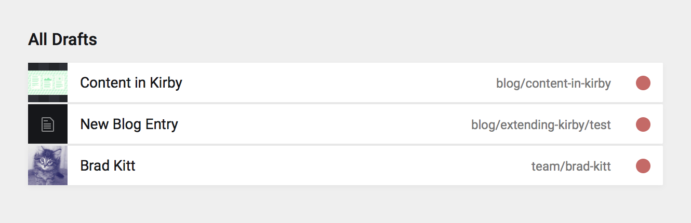

# Kirby Drafts Field


[](https://raw.githubusercontent.com/wottpal/kirby-anchor-headings/master/LICENSE)


A section which shows all drafted pages from the whole site.




## Usage

Just put it in your `/site/plugins` folder or install it as a git submodule. Then add the `drafts`-field where you want (likely in `site.yaml`).

```yaml
drafts:
  type: drafts
  label: All Drafts
  layout: list
  exclude:
    - team/bob-meowerly
    - error
```
